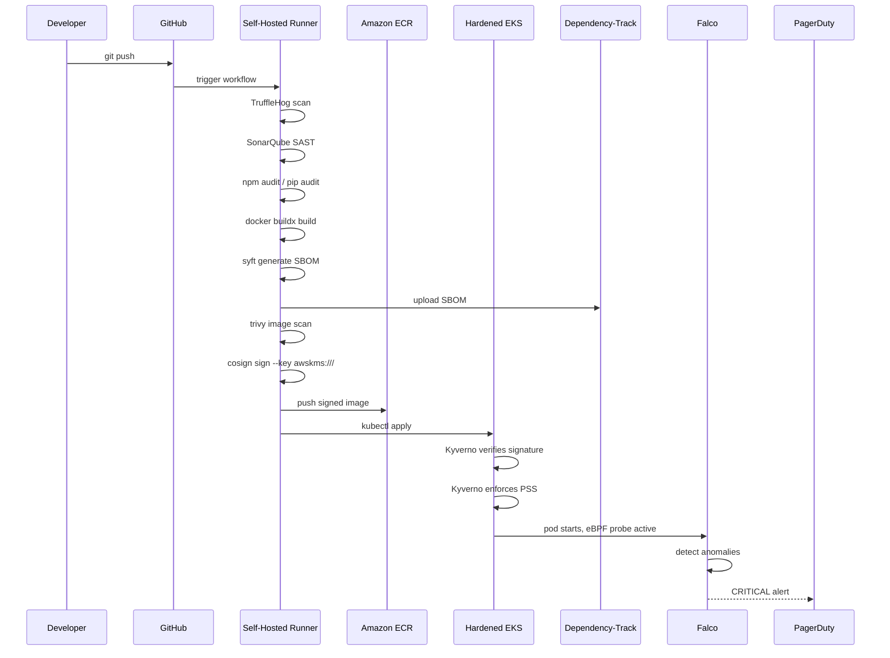

# Silsila Hardened Pipeline

> **Zero-Trust Software Supply Chain for Saudi Financial Services (SAMA Compliant)**

This repository contains a complete, production-ready AWS infrastructure project implementing an end-to-end secure software factory. It takes code from developer commit all the way to signed, scanned, SBOM-tracked, runtime-monitored production workloads running on a hardened Amazon EKS cluster. Every stage of the pipeline is a security gate that cannot be bypassed, and every artifact is cryptographically signed, scanned for vulnerabilities, and tracked with a CycloneDX Software Bill of Materials (SBOM).

## How It Works (For Beginners!)

Imagine you are baking a cake, and you want to make absolutely sure no bad ingredients get in, the recipe is followed perfectly, and nobody tampers with it before it reaches the party. This project does exactly that, but for computer code!

Here is the step-by-step journey of your code:
1. **You write code** and hit "save and send" (commit).
2. **The Guard checks your pockets**: Before your code even leaves your computer, a tool checks if you accidentally left any secret passwords in it.
3. **The Proofreader checks your spelling**: Another tool reads your code to make sure it's written well and doesn't have obvious mistakes.
4. **The Ingredient Check**: We check all the extra pieces of code (libraries) you used from the internet to make sure none of them are known to be broken or unsafe.
5. **Boxing it up**: Your code gets packed into a secure box (called a container), and a list of everything inside is attached to the outside (like an ingredient label).
6. **The X-Ray Machine**: We scan the whole box to look for any hidden weaknesses.
7. **The Wax Seal**: If the box passes all tests, we put a special, un-fakeable wax seal (digital signature) on it.
8. **The Delivery Guard**: When the box arrives at the live website, a guard checks the wax seal. If the seal is broken or missing, the box is rejected!
9. **The Security Camera**: Even after your code is running on the live website, cameras (runtime monitoring) watch it 24/7. If it tries to do something weird, an alarm goes off immediately!

In short: **As soon as you write code**, it goes through an automated gauntlet of security checks. If it passes every single one, it gets a "stamp of approval" and goes live to the users. If it fails *any* check, the process stops right there to keep everything safe!

## What Is This Project?

The **Secure Software Factory (SSF)** is a reference architecture and Terraform-based implementation of a DevSecOps pipeline designed specifically for financial institutions operating under the Saudi Arabian Monetary Authority (SAMA) Cyber Security Framework. It addresses the critical need for organizations like STC Pay, Alinma Bank, and other SAMA-regulated entities to ensure that every piece of software deployed to production is trustworthy, traceable, and tamper-evident.

In today's threat landscape, supply chain attacks are among the most devastating vectors adversaries exploit. By compromising a single upstream dependency or build step, attackers can inject malicious code that propagates to thousands of downstream consumers. The Secure Software Factory eliminates this risk by enforcing cryptographic signing at every stage, mandating vulnerability scanning before deployment, and continuously monitoring runtime behavior for anomalies.

## What Does It Do?

This project automates the entire secure software supply chain:

1. **Developer Commit** — Developers push code to GitHub. Pre-commit hooks run TruffleHog to prevent secrets from entering the repository.
2. **Secret Scanning** — The CI pipeline scans the entire commit history and working tree for verified secrets using TruffleHog.
3. **Static Application Security Testing (SAST)** — SonarQube analyzes code quality, enforces coverage > 80%, and blocks critical bugs.
4. **Dependency Scanning** — npm audit, pip audit, and OWASP Dependency-Check identify vulnerable libraries.
5. **Build & SBOM Generation** — Docker Buildx builds multi-arch images. Syft generates a CycloneDX 1.5 SBOM.
6. **Container Scanning** — Trivy scans OS packages and application libraries for HIGH/CRITICAL CVEs.
7. **Image Signing** — Cosign signs the image using an AWS KMS asymmetric key (RSA 4096). The SBOM is attached to the image.
8. **Infrastructure as Code (IaC) Scanning** — Checkov, Terrascan, and Snyk scan Terraform for misconfigurations.
9. **Deployment to Hardened EKS** — Kyverno admission controllers verify the image signature and enforce Pod Security Standards before allowing the pod to schedule.
10. **Runtime Monitoring** — Falco detects crypto-mining, reverse shells, unauthorized kubectl exec, and privilege escalation in real-time.
11. **SBOM Analysis** — Dependency-Track ingests every SBOM, tracks vulnerabilities across versions, and calculates Mean Time To Patch (MTTP).
12. **Observability** — Grafana dashboards visualize MTTP, supply chain security score, runtime threats, and pipeline gate failures.

## Why This Architecture?

Traditional CI/CD pipelines treat security as an afterthought — a scanning step tacked on at the end that developers learn to ignore or bypass. This architecture inverts that model by making security the foundation upon which every other step depends. You cannot deploy to production if any gate fails. You cannot run an unsigned image. You cannot pull from DockerHub. You cannot exec into a production pod without triggering an immediate alert.

This approach aligns with:

- **SAMA Cyber Security Framework** — Specifically Principles 3.2 (Asset Management), 3.3 (Risk Assessment), 3.4 (Patch & Vulnerability Management), and 3.5 (Incident Response).
- **NIST SSDF** — Secure Software Development Framework, emphasizing prepare, protect, produce, and respond phases.
- **SLSA (Supply Chain Levels for Software Artifacts)** — Levels 2-3 compliance through provenance, signing, and hermetic builds.
- **Zero-Trust Architecture** — Never trust, always verify. Every workload, every identity, every request is validated.

## Architecture Overview

```mermaid
flowchart LR
    subgraph Developer["Developer Workstation"]
        A[Pre-commit Hooks<br/>TruffleHog + Trivy]
    end

    subgraph GitHub["GitHub Repository"]
        B[Push to Main]
    end

    subgraph Pipeline["GitHub Actions Pipeline<br/>Self-Hosted Runners on EKS"]
        C[Secret Scan<br/>TruffleHog Git + FS]
        D[SAST<br/>SonarQube Quality Gate]
        E[Dependency Scan<br/>npm/pip/OWASP DC]
        F[Build + SBOM<br/>Docker Buildx + Syft]
        G[Container Scan<br/>Trivy HIGH/CRITICAL]
        H[Image Sign<br/>Cosign + KMS]
        I[IaC Scan<br/>Checkov + Terrascan + Snyk]
    end

    subgraph Platform["Hardened EKS Platform"]
        J[Kyverno Admission<br/>Verify Signatures + Enforce PSS]
        K[Falco Runtime<br/>eBPF Threat Detection]
        L[Dependency-Track<br/>SBOM Analysis + MTTP]
        M[Grafana Dashboards<br/>Security Metrics + PagerDuty]
    end

    A --> B
    B --> C
    C --> D
    D --> E
    E --> F
    F --> G
    G --> H
    H --> I
    I --> J
    J --> K
    K --> M
    F --> L
    L --> M
```



### Supply Chain Flow Detail



## Security Gates Explained

| Gate | Tool | What It Catches | What It Blocks | Bypass Prevention |
|------|------|-----------------|----------------|-------------------|
| Secret Scan | TruffleHog | AWS keys, DB passwords, private keys in git history and filesystem | Build fails immediately | `--only-verified --fail`, pre-commit hooks |
| SAST | SonarQube | Critical bugs, security hotspots, coverage < 80% | Merge blocked by quality gate | Quality gate enforced in CI |
| Dependency Scan | npm audit / pip audit / OWASP DC | Known CVEs in direct dependencies | Build fails on HIGH+ CVE | `--audit-level=high` |
| Container Scan | Trivy | OS and application CVEs in built image | Image push blocked | `--exit-code 1 --severity HIGH,CRITICAL` |
| Image Sign | Cosign + AWS KMS | Unsigned or tampered images | Deployment blocked by Kyverno | KMS key policy restricts signers |
| IaC Scan | Checkov + Terrascan + Snyk | Public S3, unencrypted EBS, open security groups | PR merge blocked | Runs on every PR to `terraform/**` |
| Runtime Verify | Falco | Crypto-mining, reverse shells, privilege escalation | Lambda auto-isolates pod | eBPF probe at kernel level |

## SBOM Strategy

A Software Bill of Materials (SBOM) is a formal, machine-readable inventory of software components and dependencies. In regulated industries, SBOMs are no longer optional — they are essential for vulnerability management, license compliance, and incident response.

This project uses **CycloneDX 1.5** because it is:
- Standardized by OWASP and widely adopted
- Rich in vulnerability and license metadata
- Compatible with Dependency-Track for centralized analysis

### How It Works

1. **Generation**: During every build, `syft packages dir:. -o cyclonedx-json > sbom.cdx.json` generates a complete inventory.
2. **Validation**: `cyclonedx-cli validate` ensures the output conforms to the CycloneDX 1.5 schema.
3. **Signing**: The SBOM is signed with the same Cosign KMS key used for images, creating a tamper-evident record.
4. **Upload**: The signed SBOM is uploaded to Dependency-Track via API, where it is analyzed for vulnerabilities, outdated components, and license risks.
5. **Query**: Grafana dashboards query Dependency-Track's API to calculate MTTP metrics and display SBOM coverage across all services.

### Export Formats

Dependency-Track supports exporting SBOMs in:
- CycloneDX (JSON/XML)
- SPDX
- CSV for executive reporting

## Image Signing & Verification

### Cosign + AWS KMS

Every container image is signed using **Cosign** with an **AWS KMS asymmetric RSA 4096 key**. The key policy strictly controls who can sign:

- **Allowed**: GitHub Actions self-hosted runner IRSA role
- **Denied**: Everyone else by default
- **Protection**: 30-day deletion window, MFA required for deletion, automatic key rotation

### Keyless Signing (Future-Proofing)

The architecture also documents keyless signing via Sigstore Fulcio and Rekor. When `enable_keyless_signing = true`, the pipeline uses OIDC tokens from GitHub Actions to authenticate to Fulcio, which issues short-lived certificates. This eliminates key management overhead while maintaining non-repudiation through Rekor's transparency log.

### Kyverno Verification

At deployment time, Kyverno's `verify-image-signatures` ClusterPolicy intercepts every Pod creation request. It:

1. Extracts the image reference from `spec.containers[*].image`
2. Queries the KMS key (or Sigstore Rekor) for the signature
3. Rejects the Pod if verification fails
4. Logs the rejection event for audit and alerting

If verification fails, the pod is **rejected at admission time** — it never schedules on a node. An event is logged, and Falco can optionally alert on repeated failures (indicative of an attack or misconfiguration).

## Runtime Threat Response

### Falco Rules

Falco runs as a privileged DaemonSet on every EKS node with an eBPF probe (Bottlerocket-compatible). It monitors syscalls and Kubernetes audit events in real-time.

| Rule | Priority | Description | Response |
|------|----------|-------------|----------|
| Crypto Mining Detection | CRITICAL | Connections to known mining pools | PagerDuty + Lambda pod isolation |
| Reverse Shell Detection | CRITICAL | `/bin/bash -i`, `nc -e`, socket shells | PagerDuty + Lambda pod isolation |
| Unauthorized kubectl exec | WARNING | Any exec into production namespaces | Slack alert + audit log |
| S3 Exfiltration | WARNING | >100MB outbound S3 traffic | Slack alert |
| Privilege Escalation | CRITICAL | `setuid`, `sudo`, `su` execution | PagerDuty |
| SAMA Audit Secret Access | NOTICE | All Secrets Manager access | S3 archive (7-year retention) |

### Alert Routing (Falcosidekick)

- **PagerDuty**: Critical alerts (crypto-mining, reverse shell) trigger immediate incident creation with escalation policies.
- **Slack/Teams**: Warning-level alerts go to the security operations channel.
- **S3 Archive**: All Falco events are archived to S3 with 7-year retention for SAMA audit compliance.
- **Prometheus**: Metrics are scraped for Grafana visualization.

### Auto-Response Lambda

For CRITICAL Falco alerts, an AWS Lambda function is triggered via SNS. The Lambda:

1. Identifies the offending pod from Falco's output fields
2. Injects a deny-all NetworkPolicy targeting the pod's labels
3. Optionally deletes the pod if configured (`enable_auto_response = true`)
4. Logs the response action to CloudWatch for forensic analysis

### Incident Response Runbook

See `docs/runbooks/` for detailed playbooks covering:
- CVE detected in production image
- Secret leak detected by TruffleHog
- Runtime threat detected by Falco
- Kyverno mass-blocking event (possible policy misconfiguration or attack)

## SAMA Compliance Mapping

| SAMA CSF Control | Implementation |
|------------------|----------------|
| 3.2.1 Asset Inventory | ECR repository tagging, SBOM inventory in Dependency-Track |
| 3.2.2 Asset Classification | Security levels (`standard` / `hardened` / `maximum`) per environment |
| 3.3.1 Risk Assessment | Trivy, Snyk, SonarQube findings feed risk register |
| 3.4.1 Patch Management | MTTP dashboard with 7-day threshold for critical CVEs |
| 3.4.2 Vulnerability Management | Dependency-Track tracks all components; alerts on new CVEs |
| 3.5.1 Incident Detection | Falco + GuardDuty + Kyverno policy reports |
| 3.5.2 Incident Response | PagerDuty integration + runbooks + auto-isolation Lambda |
| 3.6.1 Audit Logging | CloudWatch + VPC Flow Logs + S3 archive (7 years) |
| 3.6.2 Log Protection | KMS encryption for all logs, MFA delete on S3 |
| 3.7.1 Encryption | KMS everywhere: EKS secrets, ECR images, S3 buckets, RDS, CloudWatch |
| 3.7.2 Key Management | Automatic rotation, least-privilege key policies, 30-day deletion window |
| 3.8.1 Access Control | IRSA for every workload, no cluster-admin for runners, least-privilege SGs |
| 3.9.1 Network Security | Private subnets only, VPC endpoints, explicit Security Groups, NetworkPolicies |

## Self-Hosted Runner Security

GitHub-hosted runners are shared, ephemeral, and outside your security boundary. This project deploys **self-hosted runners on EKS** with aggressive isolation:

- **Namespace Isolation**: Runners live in `github-runners` namespace with `restricted` Pod Security Standards.
- **Network Lockdown**: NetworkPolicy denies all egress except DNS (kube-system), HTTPS (443), and intra-VPC (ECR, S3, Secrets Manager endpoints).
- **No Cluster-Admin**: Runners have a Role (not ClusterRole) limited to `pods`, `pods/log` in their own namespace.
- **Ephemeral Pods**: Runners are stateless; `runner-rbac.yaml` prevents persistent volume access.
- **Anti-Poisoning**: `scripts/rotate-runners.sh` and the `runner-autoscaling.yml` workflow perform rolling restarts every 6 hours.
- **IRSA, Not Credentials**: Runners assume IAM roles via IRSA — no AWS access keys in environment variables or secrets.

## Policy as Code Catalog

| Policy | Severity | Action | Exception Process |
|--------|----------|--------|-------------------|
| verify-image-signatures | critical | Enforce | Submit PR to `kubernetes/kyverno/exceptions/` with justification |
| restrict-image-registries | critical | Enforce | Emergency override via break-glass cluster-admin |
| require-resource-limits | medium | Enforce | None — all workloads must define limits |
| require-non-root | high | Enforce | None — running as root is never permitted |
| disallow-host-path | high | Enforce | None — hostPath is forbidden |
| disallow-privilege-escalation | high | Enforce | None — privilege escalation is forbidden |
| restrict-external-ips | medium | Enforce | None — externalIPs are forbidden |
| enforce-pod-security-standards | critical | Enforce | Pre-configured exceptions for `kube-system`, `kyverno`, `falco`, `github-runners` only |

## Cost of Security

Estimated monthly cost for a medium-sized deployment (me-central-1):

| Service | Cost (USD) | Notes |
|---------|-----------|-------|
| EKS Cluster | $73 | Control plane |
| EKS Nodes (system) | $150 | 2x m6i.large on-demand |
| EKS Nodes (workloads) | $200 | 2-10 m6i.large spot |
| ECR Enhanced Scanning | $0.10/image | ~$50/mo for 500 images |
| GuardDuty EKS | $1.20/vCPU | ~$30/mo |
| KMS Keys | $1/key | ~$5/mo for multiple keys |
| Dependency-Track RDS | $200 | db.r6g.large Multi-AZ |
| Dependency-Track Compute | $100 | EKS pods |
| Self-Hosted Runners | $50 | Additional node capacity |
| CloudWatch Logs | $50 | Ingestion + archival |
| **Total** | **~$900-1100/mo** | Varies with workload |

For a Saudi bank processing millions of transactions, this is negligible compared to the cost of a single supply chain breach.

## Troubleshooting

### Kyverno Blocking Valid Deployments

- **Signature missing**: Ensure Cosign signed the image. Check `cosign verify --key awskms:///alias/cosign-key <image>`.
- **Registry typo**: Only `*.dkr.ecr.*.amazonaws.com/*` is allowed. Update `restrict-image-registries` if using private ECR in multiple regions.
- **Policy exception needed**: Submit a PR adding an exception to `kubernetes/kyverno/exceptions/`. Emergency break-glass: `kubectl delete clusterpolicy <name>` (logged and alerted).

### Falco False Positives

- **Legitimate high CPU**: Adjust Falco rules to exclude known CI/CD pod labels.
- **Known scripts**: Add exceptions to `falco-rules-custom.yaml` for approved maintenance scripts.
- ** kubectl exec by SREs**: Create a dedicated SRE service account and exclude it in the rule condition.

### Cosign Signing Failures

- **KMS permissions**: Verify the runner's IRSA role has `kms:Sign` on the cosign key.
- **OIDC token expiry**: Keyless signing tokens expire after 5 minutes. Retry the job.
- **Region mismatch**: Ensure the KMS key exists in the same region as the ECR registry.

### TruffleHog False Positives

- **Test data**: Add `.trufflehog-ignore` or mark files with `// trufflehog:ignore`.
- **Example keys**: Use `gitleaks:allow` or move examples to a separate repository.

### SBOM Upload Failures

- **Dependency-Track API key**: Verify `DTRACK_API_KEY` secret in GitHub.
- **Project UUID mismatch**: Use `projectName` with `autoCreate=true` in the upload curl command.
- **Network policy**: Ensure the runner can reach Dependency-Track via the VPC endpoint or service mesh.

### Runner Pods Stuck Pending

- **Resource quotas**: Check `github-runners` namespace quota. Increase if needed.
- **Network policy blocking GitHub API**: Ensure egress to `api.github.com` and `*.actions.githubusercontent.com` is allowed.
- **Image pull failures**: Verify the runner image is in ECR and the node IAM role has pull permissions.

## Developer Onboarding

### Local Pre-Commit Setup

```bash
# Install pre-commit
pip install pre-commit

# Install hooks
pre-commit install

# Test manually
pre-commit run --all-files
```

### Reading Security Scan Results

- **TruffleHog**: Check the artifact `secret-scan-report` in the GitHub Actions run.
- **Trivy**: SARIF results appear in the GitHub Security tab under "Code scanning alerts".
- **SonarQube**: Visit `https://sonar.ssf.local` and filter by your project.
- **Dependency-Track**: Visit `https://dependency-track.ssf.local` and search for your project.

### Requesting Policy Exceptions

1. Open a PR against `kubernetes/kyverno/exceptions/`
2. Include:
   - Namespace name
   - Policy name(s) to except
   - Business justification
   - Risk mitigation (e.g., additional Falco rules)
   - Expiration date
3. Require approval from Security Architect + Engineering Lead

## Deep Dive: Kyverno Policies

The Kyverno admission controller is the enforcement layer that ensures only compliant, signed, and properly configured workloads enter the cluster. Each ClusterPolicy is designed to fail closed — if Kyverno itself is down or unable to evaluate a policy, the webhook failure policy blocks the request rather than allowing it through.

### verify-image-signatures

This policy uses Kyverno's native `verifyImages` rule to check Cosign signatures. It supports both KMS key-based verification and keyless verification through Sigstore. The policy applies to all Pods in all namespaces except the system namespaces defined in the exception list. If a developer attempts to deploy an unsigned image, Kubernetes returns an admission webhook error immediately, and the deployment fails at the API server level — the pod never reaches the scheduler.

### restrict-image-registries

This policy prevents supply chain contamination from public registries. By restricting images to `*.dkr.ecr.*.amazonaws.com/*`, we ensure that every image has passed through our own ECR scanning pipeline. This blocks DockerHub, Quay, GHCR, and any other external registry that has not been explicitly approved. In emergency scenarios, a break-glass cluster-admin can temporarily exempt a namespace, but this action is logged and alerted.

### require-resource-limits

Resource limits are not just a performance concern — they are a security control. A container without memory limits can trigger an OOM kill on the node, causing denial of service for neighboring pods. A container without CPU limits can exhaust node resources. This policy enforces that both CPU and memory limits are explicitly defined for every container.

### require-non-root

Running containers as root is one of the most common and dangerous misconfigurations. This policy enforces `runAsNonRoot: true` at the pod level and `allowPrivilegeEscalation: false`, `readOnlyRootFilesystem: true`, and `capabilities: drop: ["ALL"]` at the container level. Together, these settings implement the principle of least privilege for container processes.

### disallow-host-path

`hostPath` volumes allow containers to mount directories from the host filesystem, breaking the container isolation boundary. This policy rejects any pod that attempts to use a `hostPath` volume, preventing attackers from reading sensitive host files like `/etc/kubernetes/pki` or modifying system binaries.

### disallow-privilege-escalation

Even if a container starts as non-root, a process with `allowPrivilegeEscalation: true` can use `setuid` binaries to gain root privileges. This policy ensures that `allowPrivilegeEscalation` is explicitly set to `false` for every container.

### restrict-external-ips

Services with `externalIPs` can hijack traffic intended for other hosts. This policy prevents Services from specifying externalIPs, mitigating a known Kubernetes network security risk.

### enforce-pod-security-standards

Rather than relying solely on the built-in Pod Security Admission (PSA) controller, this policy uses Kyverno to enforce the `restricted` Pod Security Standards profile. This provides more granular control, better audit logging, and integration with Kyverno's policy report ecosystem.

## Deep Dive: Secrets Management Architecture

Secrets are the keys to the kingdom. This project implements a defense-in-depth secrets strategy with three layers:

### Layer 1: AWS Secrets Manager

All secrets — database passwords, API keys, OAuth client credentials — are stored in AWS Secrets Manager with automatic rotation:
- **Database credentials**: Rotated every 30 days via a custom Lambda function
- **API keys**: Rotated every 90 days via a separate Lambda function
- **Encryption**: All secrets encrypted with a dedicated customer-managed KMS key with automatic annual rotation
- **Access control**: Only specific IRSA roles and admin IAM roles can read secrets; no broad `secretsmanager:GetSecretValue` permissions

### Layer 2: Secrets Manager CSI Driver

The CSI driver mounts secrets as files inside pods rather than environment variables. This prevents leakage through `/proc/*/environ`, which is readable by any process running as the same user. Applications read secrets from `/mnt/secrets-store/<secret-name>` just like any other file.

### Layer 3: External Secrets Operator (ESO)

ESO synchronizes Secrets Manager secrets to Kubernetes Secrets automatically. When a secret is rotated in Secrets Manager, ESO detects the change and updates the corresponding Kubernetes Secret within minutes. This allows applications that expect Kubernetes Secrets to benefit from automatic rotation without code changes.

## Deep Dive: Network Architecture

The networking module implements a secure, segmented network design:

- **Private Subnets Only**: EKS nodes, runners, and workloads run exclusively in private subnets. There is no direct internet access from compute resources.
- **NAT Gateways**: One NAT Gateway per AZ provides controlled outbound internet access for image pulls and API calls. All NAT Gateway traffic is logged via VPC Flow Logs.
- **VPC Endpoints**: Interface and Gateway VPC endpoints for ECR (API + DK), S3, Secrets Manager, CloudWatch Logs, and STS ensure that AWS service traffic never leaves the AWS backbone. This reduces exposure to man-in-the-middle attacks and eliminates public internet dependencies.
- **Security Groups**: Explicit least-privilege Security Groups. The EKS node security group allows only inter-node communication and HTTPS outbound. The ALB security group allows only port 443 from the internet, protected by AWS WAF.
- **VPC Flow Logs**: All traffic is logged to an encrypted S3 bucket with 7-year retention (2555 days), meeting SAMA audit requirements.

## Roadmap

| Milestone | Target | Description |
|-----------|--------|-------------|
| SLSA Level 3 | Q3 2024 | Hermetic builds, provenance attestations, reproducible builds |
| Sigstore Rekor Private | Q3 2024 | Private Rekor instance for internal transparency log |
| Snyk Code (SAST) | Q4 2024 | Replace/augment SonarQube with Snyk Code for AI-powered findings |
| Chainguard Images | Q4 2024 | Base images from Chainguard with zero CVEs and SBOMs included |
| AWS CodeWhisperer | Q1 2025 | AI-generated code security scans in IDE |
| Automated Patch PRs | Q1 2025 | Dependabot/Renovate integration with auto-merge for patch-level CVEs |
| Confidential Computing | Q2 2025 | AWS Nitro Enclaves for sensitive cryptographic operations |

## Project Structure

```
.
├── Makefile                          # Build automation: init, plan, apply, scan, test
├── README.md                         # This file
├── .pre-commit-config.yaml           # Local pre-commit hooks
├── terraform.tfvars                  # Global variable overrides
├── terraform/
│   ├── backend.tf                    # S3 + DynamoDB remote state
│   ├── providers.tf                  # AWS, Helm, Kubernetes, GitHub providers
│   ├── data.tf                       # Data sources for caller identity, AZs, EKS auth
│   ├── variables.tf                  # Global variables with validation blocks
│   ├── main.tf                       # Orchestrator module composition
│   ├── environments/
│   │   ├── dev/
│   │   ├── staging/
│   │   └── prod/
│   └── modules/
│       ├── networking/               # VPC, subnets, VPC endpoints, flow logs
│       ├── eks_hardened/             # Private EKS, IRSA, GuardDuty, Security Hub
│       ├── ecr_secure/               # Immutable repos, enhanced scanning, replication
│       ├── github_runners/           # ARC v2 on EKS with IRSA and NetworkPolicy
│       ├── kyverno_policies/         # Helm + ClusterPolicies (signatures, PSS, limits)
│       ├── runtime_security/         # Falco + Falcosidekick + auto-response Lambda
│       ├── observability_sec/        # Prometheus + Grafana + PagerDuty + CloudWatch
│       ├── sbom_platform/            # Dependency-Track on EKS with RDS + S3
│       ├── signing_infrastructure/   # KMS key for Cosign + GitHub OIDC
│       └── secrets_management/       # Secrets Manager rotation + CSI driver + ESO
├── kubernetes/
│   ├── kyverno/                      # ClusterPolicies, reports, exceptions
│   ├── falco/                        # Custom rules, sidekick values, daemonset
│   ├── github-runners/               # Runner deployment, network policy, RBAC
│   ├── dependency-track/             # Deployment, ingress, configmap
│   └── grafana-dashboards/           # MTTP, supply chain, runtime, pipeline JSON
├── .github/
│   └── workflows/
│       ├── devsecops-pipeline.yml    # Complete commit-to-prod pipeline
│       ├── terraform-security-scan.yml
│       ├── sbom-generation.yml
│       └── runner-autoscaling.yml
├── policies/
│   ├── kyverno-tests/                # kyverno-test.yaml + test resources
│   ├── opa-terraform/                # Rego policies for Terraform plan scanning
│   └── falco-rules/                  # Additional SAMA-specific audit rules
├── scripts/
│   ├── bootstrap-backend.sh          # Idempotent S3 + DynamoDB creation
│   ├── pre-flight-checks.sh          # Tool and credential validation
│   ├── install-kyverno-cli.sh
│   ├── generate-sbom.sh              # Syft + CycloneDX + Cosign sign
│   ├── verify-deployment.sh          # Pre-deployment gate checks
│   └── rotate-runners.sh             # Graceful runner pod rotation
├── .cosign/
│   ├── cosign.pub                    # Public key reference
│   └── policy.yaml                   # Cosign verification policy
└── docs/
    ├── supply-chain-diagrams/        # Mermaid source files
    ├── runbooks/                     # Incident response playbooks
    └── compliance-mapping/           # SAMA requirement mapping
```

## Quick Start

```bash
# 1. Clone and enter repository
git clone https://github.com/your-org/secure-software-factory.git
cd secure-software-factory

# 2. Fill in terraform.tfvars with your AWS account, GitHub org, and secrets
vim terraform.tfvars

# 3. Run pre-flight checks
bash scripts/pre-flight-checks.sh

# 4. Bootstrap Terraform backend (idempotent)
ENV=dev bash scripts/bootstrap-backend.sh

# 5. Deploy everything
make ENV=dev all

# 6. Verify
bash scripts/verify-deployment.sh
```

## Lock Versions

- **Terraform**: ~> 1.7
- **AWS Provider**: ~> 5.0
- **Kubernetes Provider**: ~> 2.23
- **Helm Provider**: ~> 2.12
- **EKS**: 1.29
- **Kyverno**: 1.12
- **Falco**: 0.37
- **Cosign**: 2.2
- **Trivy**: 0.50
- **Syft**: 1.0
- **Dependency-Track**: 4.11
- **GitHub ARC**: 2.0

## License

This project is provided as a reference architecture for SAMA-regulated organizations. Review and adapt all controls to your specific risk profile and regulatory requirements before production deployment.

---

**Maintained by the DevSecOps Architecture Team** | **Built for the Saudi Financial Sector** | **Zero-Trust by Design**
